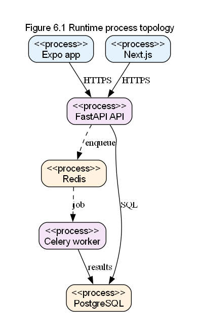
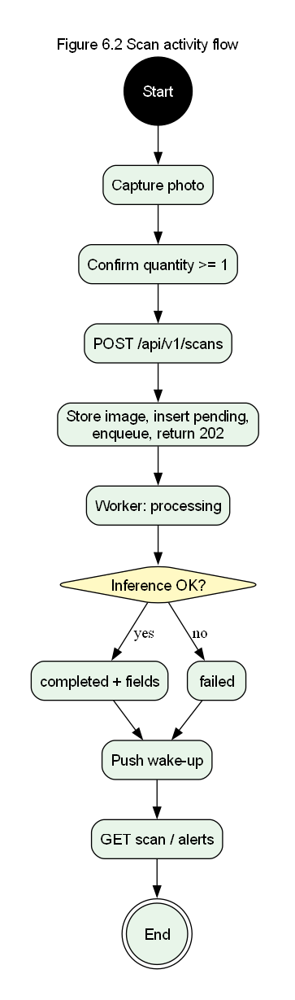
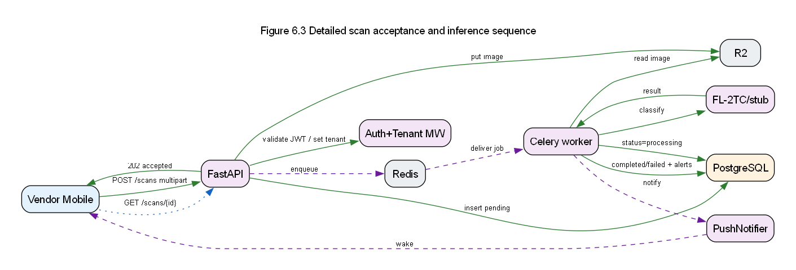
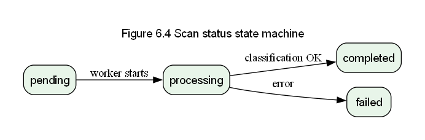
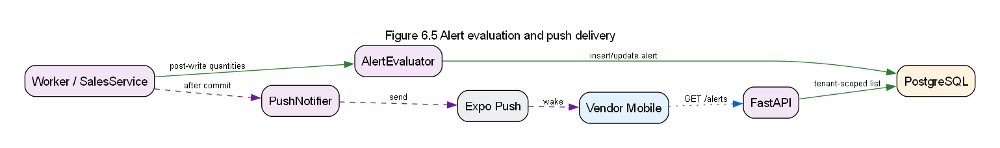
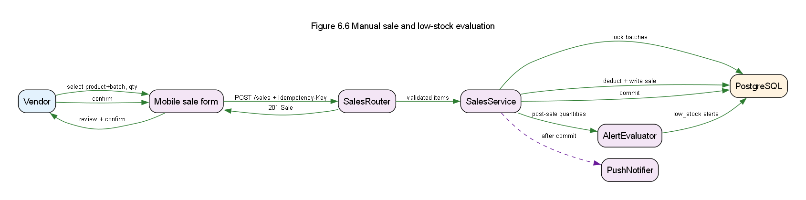
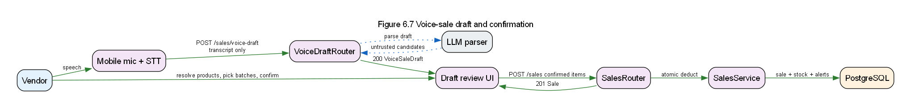

# 6. Process View

This view describes concurrent processes, messaging, scan and sale lifecycles, and transaction boundaries. It answers how work moves at runtime, not how packages are drawn in the Logical View.

## 6.1 Runtime process topology

Target V1 runs these processes:

| Process | Role |
|---|---|
| Expo mobile app | Vendor UI; camera; mic + device STT; HTTP client |
| Next.js web (browser) | Admin UI; HTTP client |
| FastAPI (Uvicorn) | Synchronous HTTPS request handling; enqueue; sales transactions |
| Celery worker | Async classification and related alert/push work |
| Redis | Celery broker; tenant-namespaced keys `tenant:{tenant_id}:...` |
| PostgreSQL | Durable state under RLS |
| External: Supabase Auth, R2, Expo Push, LLM parser | Auth, images, notifications, draft parsing |

*Figure 6.1. Runtime process topology. Solid edges are request/response or SQL. Dashed edges are asynchronous queue or push delivery.*

## 6.2 Scan acceptance and classification

`POST /api/v1/scans` must return HTTP 202 without running the CNN in the handler.

1. Auth middleware validates JWT; tenant middleware sets `app.tenant_id`.
2. API stores the image in R2 and inserts a `scans` row with status `pending`.
3. API enqueues a Celery job using a tenant-namespaced Redis key and returns 202 with the scan id.
4. Worker sets status `processing`, reads the image, runs stub or FL-2TC, writes classification fields, sets `completed` or `failed`.
5. Alert evaluation and push may follow for terminal scan outcomes.

*Figure 6.2. Scan activity from capture through worker completion.*

*Figure 6.3. Sequence for asynchronous scan acceptance. The request path ends at 202; classification continues in the worker.*

*Figure 6.4. Scan status lifecycle: pending, processing, completed, failed.*

Failure behavior: if enqueue fails after the image is stored, the API surfaces an error and does not claim acceptance. Worker failures mark the scan `failed` without blocking other tenants' queues beyond normal broker scheduling.

## 6.3 Alert evaluation and push

Alert rules for spoilage, static aging, and low stock run after relevant state changes. Scan completion can create spoilage or aging alerts. Confirmed sales re-evaluate low stock against committed post-sale `quantity_remaining` (FR-S-016, issue #19).

*Figure 6.5. After alerts are written, `PushNotifier` sends a wake-up through Expo Push. HTTP list endpoints remain the source of truth.*

Push is best-effort notification. Missing a push does not change persisted alert rows.

## 6.4 Manual sale process (mid-evaluation)

Manual sale is one product, one vendor-selected batch, one positive quantity, and explicit confirmation.

1. Mobile loads tenant products and batches under RLS.
2. Vendor confirms the line.
3. Mobile calls `POST /api/v1/sales` with an `Idempotency-Key`.
4. `SalesService` locks selected batch rows, validates remaining stock, writes `sales` / `sale_items`, deducts quantities, evaluates low stock, and commits atomically.
5. After commit, push may notify for new low-stock alerts.

The sale path is atomic and idempotent: a retried key cannot deduct stock twice, and quantities cannot go negative (NFR-R-005).

*Figure 6.6. Manual sale sequence. Deduction and low-stock evaluation happen inside the shared sales transaction path; push occurs after commit.*

## 6.5 Voice-assisted sale process (final V1)

Voice assistance adds a draft stage that cannot mutate inventory.

1. Vendor speaks; device speech-to-text produces a local transcript.
2. Mobile posts the transcript to `POST /api/v1/sales/voice-draft`.
3. `VoiceDraftRouter` calls the LLM parser adapter, schema-validates the response, and returns an untrusted draft. No sale rows are written.
4. Vendor resolves products, selects a batch per line, edits quantities, and explicitly confirms.
5. Mobile calls `POST /api/v1/sales` for confirmed items only, reusing the same atomic sales process as the manual path.
6. Raw audio and transcripts are not retained by default.

*Figure 6.7. Voice draft sequence. The LLM has no database edge. Inventory changes only after vendor confirmation through `POST /api/v1/sales`.*

If parsing fails or the vendor abandons the draft, stock is unchanged. Manual sale remains the fallback (FR-V-011, NFR-U-009).

## 6.6 Transaction boundaries summary

| Flow | Transaction boundary | Out of transaction |
|---|---|---|
| Scan accept | Insert pending scan (and related metadata) | R2 put may precede DB insert; Celery work is separate |
| Classify | Worker updates scan (+ alerts) | Push after persist |
| Manual / confirmed voice sale | Lock batches, write sale lines, deduct, evaluate low stock, commit | Push after commit; LLM call never inside this transaction |

Tenant identity for every transaction comes from the JWT-established `app.tenant_id`, never from request body fields.
