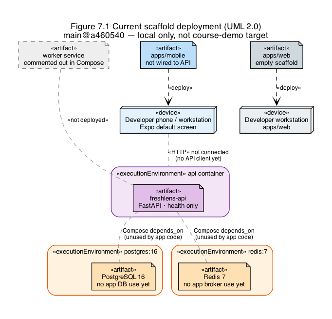
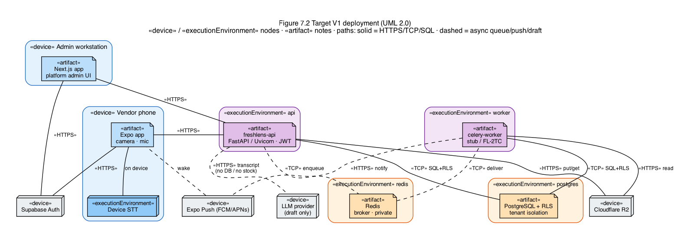

# 7. Deployment View

This view shows where processes run. It separates the current local scaffold from the target V1 topology so reviewers do not confuse aspirational nodes with what Compose starts today.

## 7.1 Current scaffold deployment (`main@a460540`)

The checked-in Docker Compose stack starts `api`, `postgres`, and `redis`. The Celery worker service is present but commented out. There is no web container. The FastAPI image exposes health endpoints and does not yet open PostgreSQL or Redis connections for business routes. Mobile is a default Expo shell on a developer workstation or phone. Object storage, Supabase Auth, Expo Push, and the LLM parser are not wired on this baseline.

This deployment is for local development only. It is not a production or course-demo target topology.

*Figure 7.1. Current scaffold on `main@a460540`. API, PostgreSQL, and Redis containers exist; worker is commented; business integrations are not yet connected.*

## 7.2 Target V1 deployment

| Node / service | Runs | Protocol / trust notes |
|---|---|---|
| Vendor phone | Expo app; device camera; mic; on-device STT | HTTPS to API; TLS to Auth; push receive |
| Admin workstation | Browser + Next.js app | HTTPS to API; TLS to Auth |
| `api` container | FastAPI / Uvicorn | Public HTTPS edge (or reverse proxy); JWT required except health |
| `worker` container | Celery + stub/FL-2TC | Private network to Redis, Postgres, R2 |
| `redis` container | Broker | Private; no public exposure |
| `postgres` container | PostgreSQL + RLS | Private; credentials via env |
| Cloudflare R2 | Scan images | HTTPS with scoped credentials |
| Supabase Auth | JWT issuer | External IdP; clients and API trust issuer keys |
| Expo Push (FCM/APNs) | Device wake | Worker -> Expo -> device; not a data plane for inventory |
| LLM provider | Transcript parse | API outbound HTTPS; draft JSON only; no DB credentials |

Configuration requirements: database URL, Redis URL, R2 keys, Supabase JWT secret or JWKS, Expo push credentials, and LLM API key via environment variables documented in `.env.example`. Secrets never enter git.

Trust boundaries: clients are untrusted; JWT proves identity; RLS enforces tenant rows; the LLM sits outside the persistence trust boundary. V1 has no dedicated API-gateway node: FastAPI performs route dispatch and JWT validation on the `api` container; a reverse proxy, if present, is limited to TLS termination and forwarding.

*Figure 7.2. Target V1 deployment. Clients, API, worker, data stores, and external auth, storage, push, and draft-parser services. The LLM has no edge to PostgreSQL.*

## 7.3 Mapping to Process and Logical views

The FastAPI process in Section 6 deploys on the `api` node. The Celery process deploys on `worker`. Domain persistence from Section 5 lives in `postgres`. Presentation packages deploy to phone and browser, not into the API image.
