# 1. Introduction

## 1.1 Purpose

This Software Architecture Document (SAD) describes the Version 1 architecture of FreshLens, an AI-powered inventory and freshness monitoring platform for small grocery vendors (CS3203 Group 21, PID 5). It translates the requirements in the System Requirements Specification (SRS) into components, interfaces, runtime processes, deployment topology, and data design.

The audience is the FreshLens development team, course mentors and examiners reviewing Milestone M2, and anyone who later extends the system. The document is the shared reference for contracts across mobile, web, API, worker, and database work.

## 1.2 Scope

This document covers FreshLens Version 1 as scoped in the Project Proposal and the revised SRS:

- Vendor mobile application (Expo / React Native)
- Platform administrator web application (Next.js)
- FastAPI application service
- Asynchronous inference pipeline (Redis, Celery, stub classifier at mid-evaluation, FL-2TC later)
- PostgreSQL with Row-Level Security
- Cloudflare R2 image storage
- Shared sales service for stock deduction, with manual mid-evaluation entry and final voice-assisted drafting

It does not cover UI wireframes, CNN training hyperparameters, IoT hardware, procurement, or accounting modules. Version 2 features such as multi-item image detection, image-based age estimation, and learned rot-date prediction appear only where they constrain a Version 1 decision.

Unless a section marks a component as implemented on the current scaffold, the design describes the approved target V1 architecture. The implementation baseline is `main` commit `a460540`.

## 1.3 Definitions and acronyms

| Term | Meaning |
|---|---|
| SAD | Software Architecture Document (this document) |
| SRS | System Requirements Specification |
| RLS | PostgreSQL Row-Level Security |
| JWT | JSON Web Token from Supabase Auth |
| FL-2TC | FreshLens Two-Tier Classifier |
| R2 | Cloudflare R2 object storage |
| Sale | Confirmed stock deduction transaction |
| Voice draft | Untrusted structured sale candidates from transcript parsing |

## 1.4 References

1. FreshLens Project Proposal, CS3203 Group 21, July 2026.
2. FreshLens Feasibility Study Report, CS3203 Group 21, July 2026.
3. FreshLens System Requirements Specification, `docs/srs/FreshLens-SRS.md`.
4. FreshLens API V1 OpenAPI contract, `docs/api/v1/openapi.yaml`.
5. P. Kruchten, "The 4+1 View Model of Architecture," IEEE Software, vol. 12, no. 6, 1995.
6. Diagram tooling: architecture figures were drawn in the diagrams.net (Draw.io) online visual editor and exported as PNG under `docs/design/diagrams/`.

## 1.5 Overview of the SAD

Section 2 states which views this document uses and how they map to FreshLens. Section 3 records architectural goals and constraints. Section 4 covers architecturally significant use cases. Sections 5 through 9 give the Logical, Process, Deployment, Implementation, and Data views. Sections 10 and 11 relate size, performance, and quality attributes to architectural mechanisms. Section 12 lists references.

# 2. Architectural representation

FreshLens uses Kruchten's 4+1 view model plus an explicit Data View. Multiple views are required because the same system must answer different questions: what functions matter architecturally, how code is packaged, how processes run concurrently, where artifacts deploy, how source maps to images, and how tenant data is stored under RLS.

## 2.1 Views used

| View | SAD section | Shows for FreshLens |
|---|---|---|
| Use-Case (+1) | Section 4 | Architecturally significant vendor and admin scenarios, including scan and sale flows |
| Logical | Section 5 | Layers, packages, significant classes, provided/required interfaces |
| Process | Section 6 | API vs Celery concurrency, scan lifecycle, alert push, sale transactions |
| Deployment / Physical | Section 7 | Current Compose scaffold and target V1 nodes |
| Implementation / Development | Section 8 | Monorepo paths, dependency rules, build artifacts |
| Data | Section 9 | Entities, keys, cardinalities, RLS, sale invariants |

Process View is required because inference and notification run outside the API request. Data View is required because tenant isolation is a database policy, not only an application filter.

## 2.2 Current versus target baseline

Baseline: `main` commit `a460540`.

| Area | Current scaffold | Target V1 |
|---|---|---|
| `apps/api` | Health endpoints only | Auth, scans, sales, products/batches list, admin tenants |
| `apps/mobile` | Default Expo screen | Camera, scan, manual sale, later voice sale, alerts |
| `apps/web` | Empty path | Admin catalogue, tenants, analytics |
| `packages/ml` | Empty path | Celery worker, stub then FL-2TC |
| `infra/db` | Empty migrations | Tenant tables + RLS, including sales |
| Compose | `api`, `postgres`, `redis`; worker commented | Adds worker; API uses DB/Redis/R2 |

## 2.3 Cross-view mapping

| Logical package | Process | Deploy node (target) | Source path | Key requirements |
|---|---|---|---|---|
| Vendor mobile | Expo app process | Vendor phone | `apps/mobile` | FR-V-*, IR-UI-001 |
| Admin web | Browser / Next.js | Admin workstation | `apps/web` | FR-A-* |
| FastAPI application | API process | `api` container | `apps/api` | FR-S-001, FR-S-014, NFR-SEC-* |
| Celery worker / FL-2TC | Worker process | `worker` container | `packages/ml` | FR-S-007, FR-S-008 |
| PostgreSQL + RLS | Database process | `postgres` | `infra/db` | DR-*, NFR-SEC-003 |
| Redis | Broker process | `redis` | Compose | IR-SW-005, NFR-SEC-006 |
| Object storage | External service | Cloudflare R2 | config | IR-SW-003 |
| LLM sale parser | External call from API | Provider endpoint | API adapter | FR-S-015, NFR-SEC-007 |

## 2.4 High-level architecture figure

Figure 2.1 shows the target V1 component topology: clients, API, async worker path, persistence, push delivery, and the draft-only LLM path used for final voice sales.

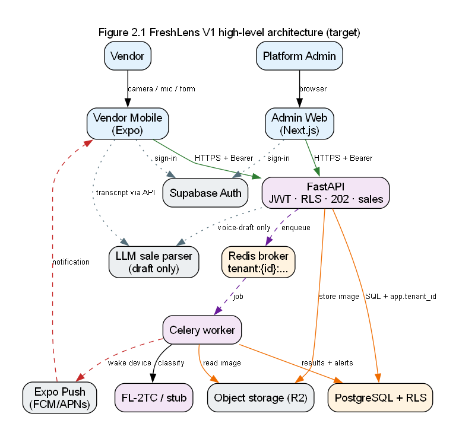

*Figure 2.1. Target V1 high-level architecture. Solid edges are synchronous HTTPS or SQL. Dashed edges are asynchronous queue or push delivery. Dotted edges are auth or draft-only parser calls. The LLM has no database edge.*

# 3. Architectural goals and constraints

This section records the goals that drive FreshLens V1 architecture and the constraints that force specific mechanisms. Each constraint ends with its architectural consequence.

## 3.1 Architectural goals

| Goal | Meaning for V1 |
|---|---|
| Tenant isolation | One vendor organization cannot read or write another vendor's rows |
| Responsive scan acceptance | Capture and submit return quickly; classification happens later |
| Correct stock after sale | Confirmed sales deduct stock once, never below zero, then feed low-stock alerts |
| Safe voice assistance | Speech helps drafting only; inventory changes require vendor confirmation |
| Course-deliverable stack | Stay on the approved FastAPI, Postgres, Celery, Expo, Next.js path |
| Honest baseline | Distinguish what `main@a460540` already runs from what V1 still targets |

## 3.2 Technical constraints

### 3.2.1 Multi-tenancy via PostgreSQL RLS

Constraint: Every business table carries `tenant_id`, and RLS policies use `current_setting('app.tenant_id')` in the same migration that creates the table (DR-001 through DR-012).

Consequence: API middleware must set `app.tenant_id` from the validated JWT before business queries. Application-level tenant filters are defense in depth only.

### 3.2.2 Asynchronous inference

Constraint: CNN or stub classification must not run inside a FastAPI request handler (FR-S-001, FR-S-008).

Consequence: `POST /api/v1/scans` stores the image, inserts a pending scan, enqueues a Celery job on Redis with tenant-namespaced keys, and returns HTTP 202. The worker owns classification and result persistence.

### 3.2.3 Shared sales service

Constraint: Only `POST /api/v1/sales` through the shared sales service may deduct `batches.quantity_remaining` (FR-S-014, DR-010, DR-011).

Consequence: Manual mid-evaluation forms and final voice confirmation both call the same sales path. Scan flows and LLM parsing cannot mutate stock.

### 3.2.4 Sale atomicity and idempotency

Constraint: Sale submission is atomic and idempotent under `Idempotency-Key`. Selected batches are locked and validated so quantities cannot become negative (NFR-R-005).

Consequence: The sales service runs deduction and related alert evaluation inside one database transaction. Retries with the same key return the original result without a second deduction.

### 3.2.5 LLM draft boundary

Constraint: Final V1 may use device speech-to-text and one provider-neutral LLM transcript parser. The parser returns an untrusted draft only and has no inventory persistence access (FR-S-015, NFR-SEC-007, DR-012 related privacy).

Consequence: `POST /api/v1/sales/voice-draft` never writes stock. Mobile resolves products, selects batches, and requires explicit confirmation before calling the shared sales API. Raw audio and transcripts are not retained by default.

### 3.2.6 Locked technology stack

Constraint: Approved stack only: FastAPI, PostgreSQL + RLS, Supabase Auth (prototype), Next.js, Expo, Celery + Redis, Cloudflare R2, Docker Compose, GitHub Actions.

Consequence: Do not introduce a Node backend, a second queue system, or sync inference. New external capability is limited to the constrained LLM parser above.

### 3.2.7 Privacy and secrets

Constraint: No secrets in git. Prefer minimum retention of sale speech artifacts.

Consequence: Configuration uses environment variables documented in `.env.example`. Voice flows discard audio and transcripts after draft creation unless a later requirement explicitly changes that policy.

## 3.3 Schedule and ownership constraints

Milestone M2 (due 9 August) requires SRS and architecture design. M3 adds auth, DB+RLS, UI skeleton, and stub ML. M4 adds real CNN, Celery, and alerts. Ownership follows CODEOWNERS: API/DB/infra for @buwaneka-halpage, web for @SMS123456789, mobile for @sathurshna, ML shared.

Consequence: The SAD must be reviewable for M2 without claiming unimplemented packages as finished. Implementation issues #80 through #84 and #19 track the sales and alert work after design approval.

## 3.4 Out of scope that shapes V1

IoT scales, automated procurement, accounting modules, multi-item image detection, and learned rot-date prediction are out of scope for V1. Architecture therefore models one product per photo, static aging from admin-configured shelf life, and sale-driven stock changes rather than hardware-driven inventory sensors.

# 4. Use-Case View

This view selects the scenarios that force architectural decisions. Ordinary CRUD that does not change concurrency, isolation, or deduction rules is omitted. Actors are Vendor and Platform Admin. External systems appear where they participate in a flow.

## 4.1 Use-case diagram

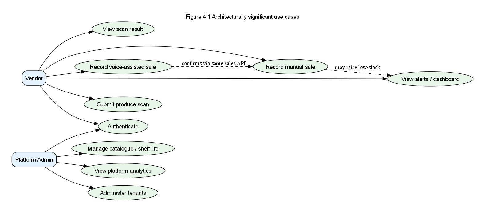

*Figure 4.1. Architecturally significant FreshLens V1 use cases. Vendor flows cover authentication, scan, sale (manual and voice-assisted), and alerts. Admin flows cover tenants, catalogue, and analytics. Sales always terminate in the shared sales service.*

## 4.2 UC-V-AUTH: Vendor authentication

| Field | Content |
|---|---|
| Actor | Vendor |
| Description | Sign in through Supabase Auth and obtain a JWT that carries tenant and role claims |
| Preconditions | Vendor account exists for a tenant |
| Main flow | 1. Vendor opens the mobile app. 2. App redirects or presents Supabase sign-in. 3. Auth returns a JWT. 4. App stores the session and attaches `Authorization: Bearer` on API calls. |
| Success | Subsequent API calls can set `app.tenant_id` from the JWT |
| Failure | Invalid credentials or missing tenant claim; API returns 401 |
| Extensions | Token refresh; sign-out clears local session |
| Requirements | FR-V-001, NFR-SEC-001, NFR-SEC-002 |

## 4.3 UC-V-SCAN: Submit produce scan

| Field | Content |
|---|---|
| Actor | Vendor |
| Description | Capture one product photo, confirm quantity, and submit for asynchronous classification |
| Preconditions | Authenticated vendor; camera available |
| Main flow | 1. Vendor captures a photo of one product. 2. Vendor confirms quantity >= 1. 3. Mobile uploads via `POST /api/v1/scans`. 4. API stores image in R2, inserts pending scan, enqueues Celery job, returns 202 with scan id. 5. Worker classifies and writes result. |
| Success | Scan accepted with HTTP 202; later status becomes completed or failed |
| Failure | Auth failure, oversized image, or enqueue failure after storage |
| Extensions | Mid-evaluation may use stub classifier; later FL-2TC |
| Requirements | FR-V-002, FR-V-003, FR-S-001, FR-S-002, FR-S-003, FR-S-008 |

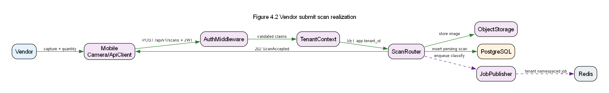

*Figure 4.2. Realization of submit produce scan. The API accepts work and returns 202. Classification runs in the worker, not in the request handler.*

## 4.4 UC-V-RESULT: View scan result

| Field | Content |
|---|---|
| Actor | Vendor |
| Description | Inspect scan status and classification for the vendor's tenant |
| Preconditions | Authenticated vendor; at least one submitted scan |
| Main flow | 1. Vendor opens scan list or detail. 2. Mobile calls list/get scan endpoints. 3. API reads under RLS and returns status, score, and classification when present. |
| Success | Vendor sees pending, processing, completed, or failed with labels when completed |
| Failure | 401/403; empty list when no scans |
| Extensions | Push wake-up may deep-link to a completed scan |
| Requirements | FR-V-004, FR-V-005, FR-S-007 |

## 4.5 UC-V-SALE-MANUAL: Record manual sale

| Field | Content |
|---|---|
| Actor | Vendor |
| Description | Mid-evaluation path: one product, one vendor-selected batch, positive quantity, explicit confirm |
| Preconditions | Authenticated vendor; product and batch with remaining stock |
| Main flow | 1. Vendor opens Record Sale. 2. Selects product and batch. 3. Enters quantity. 4. Confirms. 5. Mobile sends `POST /api/v1/sales` with Idempotency-Key. 6. Sales service locks batch, validates stock, deducts, commits, evaluates low-stock. |
| Success | Sale persisted; batch quantity reduced once; optional low-stock alert |
| Failure | Insufficient stock, missing batch, auth failure; no partial deduction |
| Extensions | Retry with same Idempotency-Key returns original sale |
| Requirements | FR-V-011, FR-S-014, FR-S-016, NFR-R-005, NFR-U-009 |

## 4.6 UC-V-SALE-VOICE: Record voice-assisted sale

| Field | Content |
|---|---|
| Actor | Vendor |
| Description | Final V1 path: device STT and LLM draft, then product resolution, batch selection, and confirmation into the shared sales API |
| Preconditions | Authenticated vendor; microphone and device speech-to-text available, or manual fallback |
| Main flow | 1. Vendor speaks a sale. 2. Device STT produces a transcript locally. 3. Mobile posts transcript to `POST /api/v1/sales/voice-draft`. 4. API calls LLM parser and returns untrusted draft lines. 5. Vendor resolves products, selects batches, edits quantities, confirms. 6. Mobile calls `POST /api/v1/sales` for the confirmed items. |
| Success | Confirmed lines deduct stock through the shared sales service |
| Failure | Parse failure, unresolved product, missing batch, or declined confirmation; inventory unchanged |
| Extensions | Vendor abandons draft and uses manual form (FR-V-011) |
| Requirements | FR-V-012, FR-S-015, FR-S-014, NFR-SEC-007, NFR-U-009, IR-HW-003, IR-SW-006 |

## 4.7 UC-V-ALERTS: View alerts and dashboard

| Field | Content |
|---|---|
| Actor | Vendor |
| Description | Review spoilage, low-stock, aging, and other alerts; see dashboard summaries |
| Preconditions | Authenticated vendor |
| Main flow | 1. Vendor opens alerts or dashboard. 2. Mobile fetches tenant-scoped alerts and summary data. 3. Push may have already woken the device for a new alert. |
| Success | Alerts listed under RLS; low-stock reflects post-sale quantities |
| Failure | Auth failure |
| Extensions | Mark-as-read if implemented later without changing alert creation rules |
| Requirements | FR-V-006, FR-V-007, FR-V-008, FR-S-009 through FR-S-013, issue #19 |

## 4.8 UC-A-TENANT: Administer tenants

| Field | Content |
|---|---|
| Actor | Platform Admin |
| Description | List and manage vendor organizations |
| Preconditions | Admin JWT with platform_admin role |
| Main flow | 1. Admin opens tenant admin screen. 2. Web calls admin tenant endpoints. 3. API enforces role and returns tenant list or updates. |
| Success | Admin sees cross-tenant administrative data allowed by role |
| Failure | Vendor JWT cannot access admin routes |
| Extensions | Create or deactivate tenant when those endpoints land |
| Requirements | FR-A-001, FR-A-002 |

## 4.9 UC-A-CATALOGUE: Manage catalogue and shelf life

| Field | Content |
|---|---|
| Actor | Platform Admin |
| Description | Maintain products and `shelf_life_days` used by V1 static aging alerts |
| Preconditions | Admin authenticated |
| Main flow | 1. Admin opens catalogue. 2. Creates or edits products and shelf-life days. 3. API persists under admin authorization. |
| Success | Products available for vendor batches and aging rules |
| Failure | Validation or auth failure |
| Extensions | Category-level defaults if introduced without breaking per-product override |
| Requirements | FR-A-005, FR-A-006 |

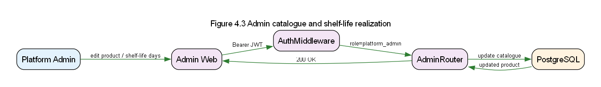

*Figure 4.3. Realization of catalogue and shelf-life administration. Admin web talks only to the API; aging rules later read `shelf_life_days` from persistence.*

## 4.10 UC-A-ANALYTICS: View platform analytics

| Field | Content |
|---|---|
| Actor | Platform Admin |
| Description | View aggregated scan, alert, and inventory analytics across tenants as authorized |
| Preconditions | Admin authenticated |
| Main flow | 1. Admin opens analytics. 2. Web requests aggregated metrics. 3. API returns aggregates without exposing unauthorized vendor detail beyond admin policy. |
| Success | Charts or tables render from API aggregates |
| Failure | Auth or empty data |
| Extensions | Export later without changing isolation rules for vendor JWTs |
| Requirements | FR-A-007, FR-A-008 |

## 4.11 Architecturally significant realizations

Scan acceptance and sale confirmation are the two realizations that lock concurrency and isolation choices. Scan must return 202 and enqueue work. Sale must be the only deduction path, atomic and idempotent, whether the UI was a form or a confirmed voice draft.

# 5. Logical View

Issue: [#49](https://github.com/FreshLens-AI/FreshLens-AI/issues/49). Parent: [#6](https://github.com/FreshLens-AI/FreshLens-AI/issues/6). Template: CS3203 SAD Section 5.

This section describes the architecturally significant design model: packages mapped to monorepo paths, significant classes, and provided or required interfaces. It is not the process view (runtime concurrency), deployment view (nodes), or implementation view (source and build rules).

Unless a class is marked as implemented on the current scaffold, named classes describe the approved target V1 design. Baseline: `main` commit `a460540` (health API and Expo shell only).

Diagram assets for this section live under `docs/design/diagrams/`. Figures 5.1 through 5.6 were drawn in the diagrams.net (Draw.io) online visual editor and exported as PNG.

Sources: SRS (`docs/srs/`), OpenAPI (`docs/api/v1/openapi.yaml`), architecture rules (Postgres RLS, async scan, shared sales service).

## 5.1 Overview

FreshLens Version 1 is organized into four logical layers.


| Layer | Responsibility | Monorepo / external |
|---|---|---|
| Presentation | Vendor and admin UIs; auth session; camera, mic, sale forms; call API with Bearer JWT | `apps/mobile`, `apps/web` |
| Application | HTTP API; JWT validation; set `app.tenant_id`; accept scans with 202; sales and voice-draft; query tenant-scoped data | `apps/api` |
| Inference | Background classification (stub or FL-2TC); write scan results; evaluate alert rules; push notify | `packages/ml` |
| Persistence / infrastructure | Tenant-isolated business data (RLS); scan images; Celery broker / tenant-namespaced Redis keys | `infra/db`, Cloudflare R2, Redis |


Clients never talk to the classifier or database directly. The API never runs CNN inference in a request handler: it stores the image, inserts a pending scan, enqueues a Celery job, and returns HTTP 202 (FR-S-001, FR-S-008). Stock deduction is isolated in the shared sales service behind `POST /api/v1/sales` (FR-S-014).

**Figure 5.1** shows this package hierarchy and the main dependency edges between packages.

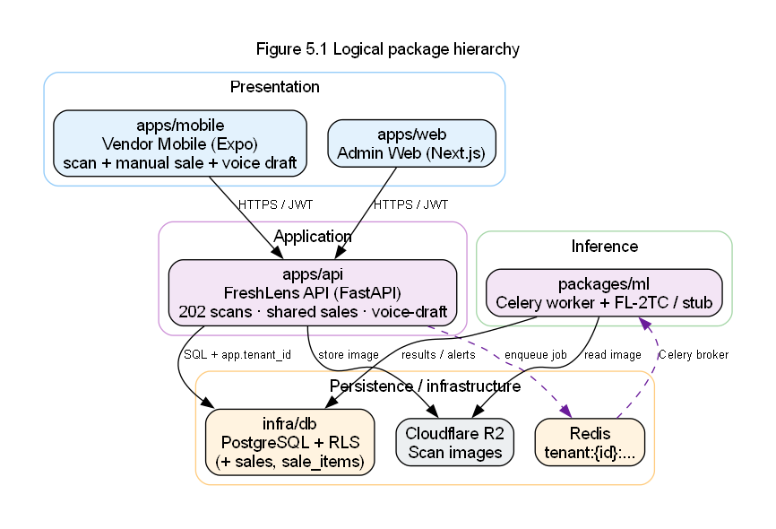

*Figure 5.1. Logical package hierarchy. Vendor mobile and admin web call the FastAPI application over HTTPS with a Supabase JWT. The API writes to PostgreSQL (with `app.tenant_id` for RLS), stores images in R2, and enqueues classification via Redis. The Celery worker in `packages/ml` reads the image, classifies, and writes results and alerts back to PostgreSQL. Sales traffic stays inside the API process until after commit, when push may notify.*

## 5.2 Architecturally significant design packages

### 5.2.1 Domain entities (shared across API, worker, and Data View)

These classes are the core business abstractions. They are persisted in PostgreSQL (`infra/db` migrations). OpenAPI already exposes scan, alert, tenant, product, batch, and sale contracts for V1; any field not yet in the scaffold is still part of the target schema.


| Class | Responsibility |
|---|---|
| `Tenant` | Isolation root for a vendor organization |
| `User` | Authenticated actor; `role` is `vendor` or `platform_admin` |
| `Product` | Catalogue item; holds `shelf_life_days` and `low_stock_threshold` for V1 alerts |
| `Batch` | Intake grouping: `intake_date`, `quantity_received`, `quantity_remaining` |
| `Scan` | One photo + vendor-confirmed quantity; async status lifecycle; classification fields nullable until complete |
| `Alert` | Low-stock, aging, spoilage, or other notice; optional links to product/batch |
| `DeviceToken` | Tenant-scoped push registration for Expo / FCM / APNs |
| `Sale` | Confirmed stock deduction header: `source`, `idempotency_key`, `created_at`, `tenant_id` |
| `SaleItem` | Line on a sale: resolved `product_id`, vendor-selected `batch_id`, `quantity_sold`, `tenant_id` |


**Figure 5.2** is the domain class diagram.

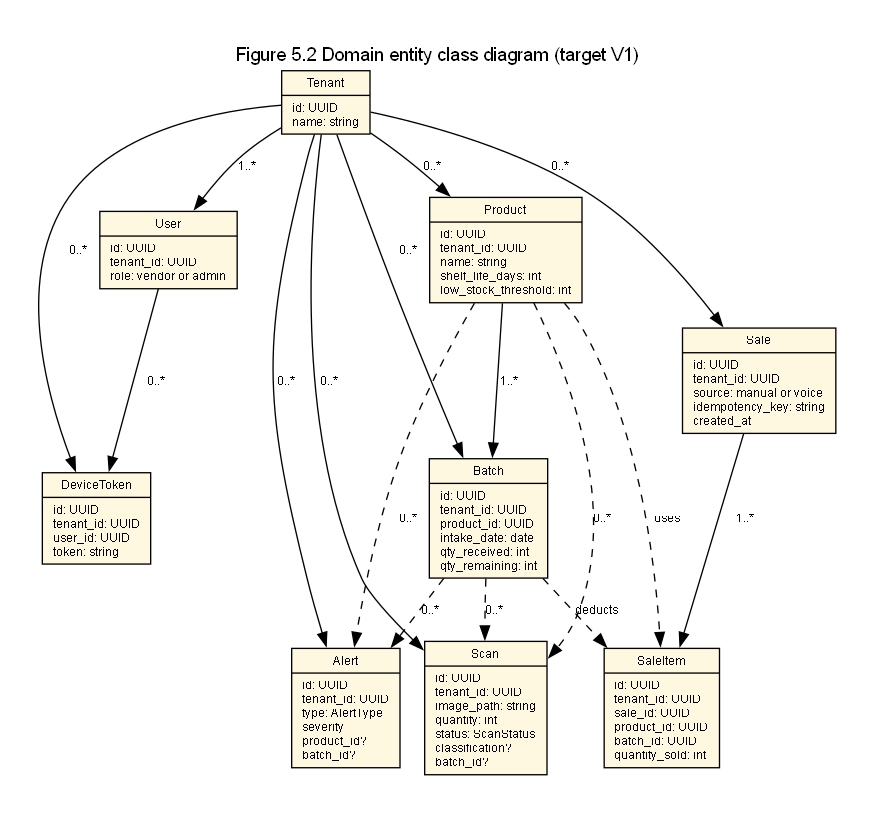

*Figure 5.2. Domain class diagram. `Tenant` owns users, products, batches, scans, alerts, device tokens, and sales. `Sale` owns `SaleItem` rows. Scans and alerts may optionally reference a product and/or batch. Attributes align with SRS Section 3.10 and OpenAPI schemas.*

Significant enumerations (not drawn as separate classes):

- `ScanStatus`: `pending` -> `processing` -> `completed` | `failed`
- `Classification`: `fresh` | `medium` | `spoiled` (FL-2TC Tier 2)
- `AlertType`: `spoilage` | `low_stock` | `aging` | `other`
- `AlertSeverity`: `info` | `warning` | `critical`
- `SaleSource`: `manual` | `voice_confirmed`

### 5.2.2 `apps/api`  -  FreshLens API

The application layer exposes the HTTP contract in `docs/api/v1/openapi.yaml`. Implemented today: health routes only. Target V1 classes:


| Class | Responsibility |
|---|---|
| `AuthMiddleware` | Validate Supabase JWT; extract `role` (`vendor` / `platform_admin`) |
| `TenantContextMiddleware` | Set Postgres session `app.tenant_id` from JWT claims (never from request body) |
| `HealthRouter` | Public liveness `GET /health` (implemented on scaffold) |
| `ScanRouter` | `POST /api/v1/scans` -> 202; list/get scans for vendor |
| `AlertRouter` | `GET /api/v1/alerts` for vendor |
| `SalesRouter` | `POST /api/v1/sales`; list/get sales under RLS |
| `VoiceDraftRouter` | `POST /api/v1/sales/voice-draft`; returns untrusted draft only |
| `AdminRouter` | `GET /api/v1/admin/tenants` for platform admin |
| `ScanService` | Create pending scan row; read/list scans under RLS |
| `SalesService` | Only component allowed to deduct stock; atomic, idempotent, non-negative batches |
| `VoiceSaleParser` | Adapter to external LLM; schema-validate draft; no DB writes |
| `ObjectStorageClient` | Put scan image to R2; return `image_path` |
| `ClassificationJobPublisher` | Enqueue Celery job with tenant-namespaced Redis keys |
| `AlertService` / `TenantService` | List alerts; list tenants for admin |


**Figure 5.3** shows these classes and their dependencies.

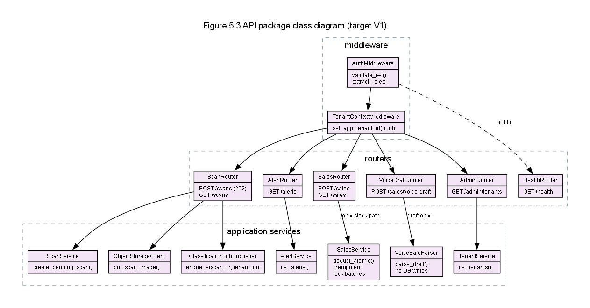

*Figure 5.3. `apps/api` class diagram. Authenticated requests pass Auth then Tenant middleware before routers. `ScanRouter` coordinates image storage, pending scan creation, and job enqueue without calling the CNN. `SalesRouter` delegates deduction to `SalesService`. `VoiceDraftRouter` calls `VoiceSaleParser` only. `HealthRouter` remains public and unauthenticated.*

### 5.2.3 `packages/ml`  -  Celery worker and FL-2TC

Inference runs only in this package. Mid-evaluation may use `StubClassifier` (`model_version = stub-v0`); the graded ML demo uses `FL2TC` (Tier 1 identify, Tier 2 freshness).


| Class | Responsibility |
|---|---|
| `ClassifyScanTask` | Celery entry: set status `processing`, classify, persist, handle failure |
| `FreshnessClassifier` | Interface: `classify(image) -> ClassificationResult` |
| `StubClassifier` / `FL2TC` | Implementations of the interface |
| `ClassificationResult` | Label, score, model version (and optional product hint) |
| `ScanResultWriter` | Persist classification fields on the scan row |
| `AlertEvaluator` | Low-stock, static aging, and spoilage alert rules (FR-S-009 through FR-S-012); also used after sales commits |
| `PushNotifier` | Expo / FCM / APNs wake-up for terminal scans and new alerts |


**Figure 5.4** shows the worker and classifier packages.

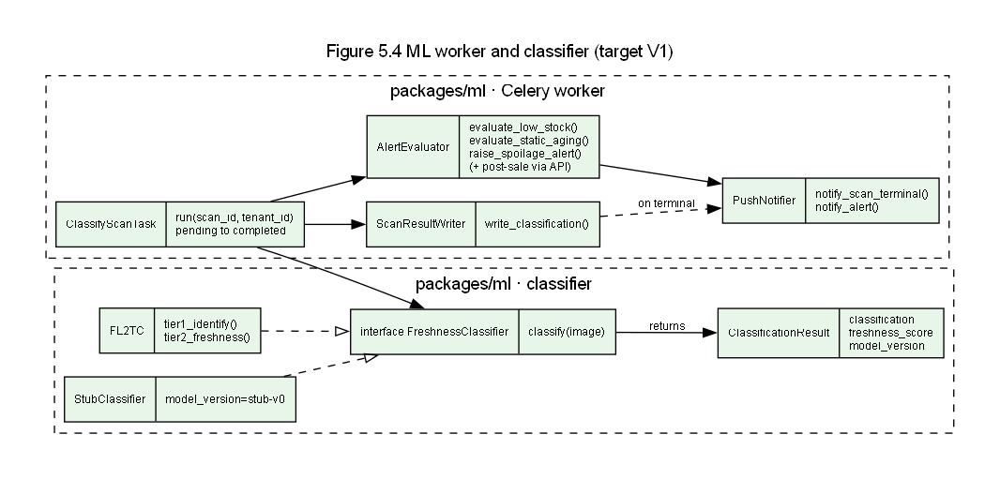

*Figure 5.4. `packages/ml` class diagram. `ClassifyScanTask` depends on the `FreshnessClassifier` interface so stub and FL-2TC can be swapped without changing the API. Results and alerts are written through dedicated writers and evaluators; push notifies the vendor without replacing the HTTP list APIs as source of truth.*

**Figure 5.6** shows the internal FL-2TC pipeline.

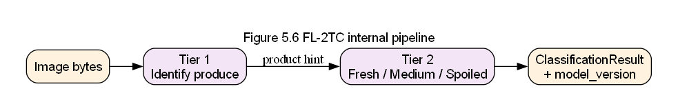

*Figure 5.6. FL-2TC Tier 1 identifies the product class; Tier 2 assigns freshness. Both tiers run only inside the worker process.*

### 5.2.4 `apps/mobile` and `apps/web`  -  client packages

Presentation-layer classes mirror the SRS vendor (FR-V-) and admin (FR-A-) flows. They hold no CNN logic in V1.


| Package | Significant classes | Responsibility |
|---|---|---|
| `apps/mobile` | `AuthSession`, `ApiClient`, `CameraCapture`, `QuantityConfirm`, `ScanSubmitController`, `ManualSaleForm`, `VoiceSaleController`, `DraftReviewScreen`, `ScanListScreen`, `AlertListScreen`, `VendorDashboard` | Sign-in, push token, capture one product photo, confirm quantity >= 1, submit for 202, manual sale, voice draft review and confirmation, list scans/alerts |
| `apps/web` | `AdminAuthSession`, `AdminApiClient`, `TenantAdminScreen`, `ProductCatalogueScreen`, `AnalyticsScreen` | Admin sign-in; tenants; catalogue / shelf-life days; aggregated analytics |


**Figure 5.5** shows both client packages.

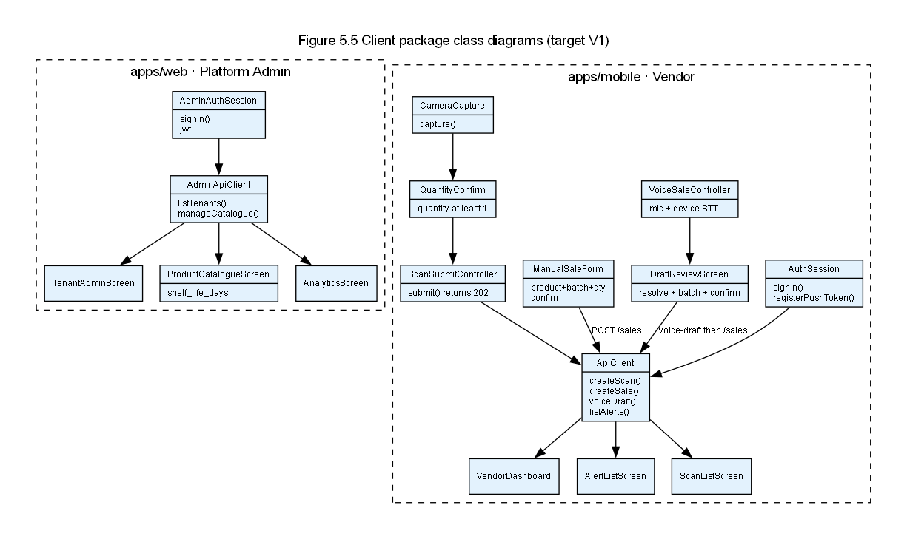

*Figure 5.5. Client class diagrams. Mobile scan flow is Camera -> Quantity -> Submit (202) via `ApiClient`. Manual and voice sale UIs both end at the shared sales API after confirmation. Web admin screens depend on `AdminApiClient` after admin auth. Both clients attach the Supabase JWT as `Authorization: Bearer`.*

## 5.3 Component interfaces

| Component | Provides | Requires |
|---|---|---|
| Vendor mobile | Camera capture, sale UI, alert list | Supabase Auth, FastAPI HTTPS, device STT, Expo Push |
| Admin web | Tenant, catalogue, analytics screens | Supabase Auth, FastAPI HTTPS |
| FastAPI application | REST OpenAPI contract; 202 scans; sales; voice-draft | JWT validation, Postgres, Redis broker, R2, LLM adapter |
| Celery worker | Classify task; alert evaluation hooks; push send | Redis, R2 read, Postgres, Expo Push gateway |
| PostgreSQL | RLS-scoped persistence | `app.tenant_id` set by API or worker session |
| Redis | Celery broker and tenant-namespaced keys | Network from API and worker only |
| LLM sale parser | Draft JSON candidates | Transcript text from API; no DB credentials |

## 5.4 Architectural patterns

| Pattern | Where applied |
|---|---|
| Layered architecture | Presentation -> Application -> Inference / Persistence |
| MVC (or MVVM-style screens) | Mobile and web presentation packages |
| Producer-consumer | API enqueues scan jobs; Celery consumes from Redis |
| Adapter | `VoiceSaleParser` and `ObjectStorageClient` isolate external providers |
| Shared service | `SalesService` is the single stock-deduction authority |

## 5.5 Traceability (requirements to logical packages)


| Concern | SRS / OpenAPI | Logical home |
|---|---|---|
| Async scan 202, no inline CNN | FR-S-001, FR-S-008 | `ScanRouter` + `ClassificationJobPublisher` + `ClassifyScanTask` |
| One product / vendor quantity | FR-S-002, FR-S-003 | `Scan`, `CameraCapture`, `QuantityConfirm` |
| Classification labels | FR-S-007 | `FreshnessClassifier`, `Scan.classification` |
| Tenant isolation | DR-002, DR-003 | `Tenant`, `TenantContextMiddleware`, RLS in `infra/db` |
| Shared sale deduction | FR-S-014, FR-S-016, NFR-R-005 | `SalesRouter`, `SalesService`, `Sale`, `SaleItem` |
| Voice draft only | FR-S-015, NFR-SEC-007 | `VoiceDraftRouter`, `VoiceSaleParser`, `DraftReviewScreen` |
| Alerts + push | FR-S-009 through FR-S-013 | `Alert`, `AlertEvaluator`, `PushNotifier`, mobile `AlertListScreen` |
| Admin catalogue / shelf-life | FR-A-005, FR-A-006 | `Product.shelf_life_days`, `ProductCatalogueScreen` |


## Acceptance checklist (issue #49)

- [x] Class diagrams included and described (Figures 5.1 through 5.6)
- [x] Packages map to monorepo paths (`apps/api`, `apps/web`, `apps/mobile`, `packages/ml`, `infra/db`)
- [x] Sales and voice-draft classes documented for target V1
- [x] Stored under `docs/design/` (this file + `docs/design/diagrams/`)

# 6. Process View

This view describes concurrent processes, messaging, scan and sale lifecycles, and transaction boundaries. It answers how work moves at runtime, not how packages are drawn in the Logical View.

## 6.1 Runtime process topology

Target V1 runs these processes:

| Process | Role |
|---|---|
| Expo mobile app | Vendor UI; camera; mic + device STT; HTTP client |
| Next.js web (browser) | Admin UI; HTTP client |
| FastAPI (Uvicorn) | Synchronous HTTPS request handling; enqueue; sales transactions |
| Celery worker | Async classification and related alert/push work |
| Redis | Celery broker; tenant-namespaced keys `tenant:{tenant_id}:...` |
| PostgreSQL | Durable state under RLS |
| External: Supabase Auth, R2, Expo Push, LLM parser | Auth, images, notifications, draft parsing |


*Figure 6.1. Runtime process topology. Solid edges are request/response or SQL. Dashed edges are asynchronous queue or push delivery.*

## 6.2 Scan acceptance and classification

`POST /api/v1/scans` must return HTTP 202 without running the CNN in the handler.

1. Auth middleware validates JWT; tenant middleware sets `app.tenant_id`.
2. API stores the image in R2 and inserts a `scans` row with status `pending`.
3. API enqueues a Celery job using a tenant-namespaced Redis key and returns 202 with the scan id.
4. Worker sets status `processing`, reads the image, runs stub or FL-2TC, writes classification fields, sets `completed` or `failed`.
5. Alert evaluation and push may follow for terminal scan outcomes.


*Figure 6.2. Scan activity from capture through worker completion.*


*Figure 6.3. Sequence for asynchronous scan acceptance. The request path ends at 202; classification continues in the worker.*


*Figure 6.4. Scan status lifecycle: pending, processing, completed, failed.*

Failure behavior: if enqueue fails after the image is stored, the API surfaces an error and does not claim acceptance. Worker failures mark the scan `failed` without blocking other tenants' queues beyond normal broker scheduling.

## 6.3 Alert evaluation and push

Alert rules for spoilage, static aging, and low stock run after relevant state changes. Scan completion can create spoilage or aging alerts. Confirmed sales re-evaluate low stock against committed post-sale `quantity_remaining` (FR-S-016, issue #19).


*Figure 6.5. After alerts are written, `PushNotifier` sends a wake-up through Expo Push. HTTP list endpoints remain the source of truth.*

Push is best-effort notification. Missing a push does not change persisted alert rows.

## 6.4 Manual sale process (mid-evaluation)

Manual sale is one product, one vendor-selected batch, one positive quantity, and explicit confirmation.

1. Mobile loads tenant products and batches under RLS.
2. Vendor confirms the line.
3. Mobile calls `POST /api/v1/sales` with an `Idempotency-Key`.
4. `SalesService` locks selected batch rows, validates remaining stock, writes `sales` / `sale_items`, deducts quantities, evaluates low stock, and commits atomically.
5. After commit, push may notify for new low-stock alerts.

The sale path is atomic and idempotent: a retried key cannot deduct stock twice, and quantities cannot go negative (NFR-R-005).


*Figure 6.6. Manual sale sequence. Deduction and low-stock evaluation happen inside the shared sales transaction path; push occurs after commit.*

## 6.5 Voice-assisted sale process (final V1)

Voice assistance adds a draft stage that cannot mutate inventory.

1. Vendor speaks; device speech-to-text produces a local transcript.
2. Mobile posts the transcript to `POST /api/v1/sales/voice-draft`.
3. `VoiceDraftRouter` calls the LLM parser adapter, schema-validates the response, and returns an untrusted draft. No sale rows are written.
4. Vendor resolves products, selects a batch per line, edits quantities, and explicitly confirms.
5. Mobile calls `POST /api/v1/sales` for confirmed items only, reusing the same atomic sales process as the manual path.
6. Raw audio and transcripts are not retained by default.


*Figure 6.7. Voice draft sequence. The LLM has no database edge. Inventory changes only after vendor confirmation through `POST /api/v1/sales`.*

If parsing fails or the vendor abandons the draft, stock is unchanged. Manual sale remains the fallback (FR-V-011, NFR-U-009).

## 6.6 Transaction boundaries summary

| Flow | Transaction boundary | Out of transaction |
|---|---|---|
| Scan accept | Insert pending scan (and related metadata) | R2 put may precede DB insert; Celery work is separate |
| Classify | Worker updates scan (+ alerts) | Push after persist |
| Manual / confirmed voice sale | Lock batches, write sale lines, deduct, evaluate low stock, commit | Push after commit; LLM call never inside this transaction |

Tenant identity for every transaction comes from the JWT-established `app.tenant_id`, never from request body fields.

# 7. Deployment View

This view shows where processes run. It separates the current local scaffold from the target V1 topology so reviewers do not confuse aspirational nodes with what Compose starts today.

## 7.1 Current scaffold deployment (`main@a460540`)

The checked-in Docker Compose stack starts `api`, `postgres`, and `redis`. The Celery worker service is present but commented out. There is no web container. The FastAPI image exposes health endpoints and does not yet open PostgreSQL or Redis connections for business routes. Mobile is a default Expo shell on a developer workstation or phone. Object storage, Supabase Auth, Expo Push, and the LLM parser are not wired on this baseline.

This deployment is for local development only. It is not a production or course-demo target topology.


*Figure 7.1. Current scaffold on `main@a460540`. API, PostgreSQL, and Redis containers exist; worker is commented; business integrations are not yet connected.*

## 7.2 Target V1 deployment

| Node / service | Runs | Protocol / trust notes |
|---|---|---|
| Vendor phone | Expo app; device camera; mic; on-device STT | HTTPS to API; TLS to Auth; push receive |
| Admin workstation | Browser + Next.js app | HTTPS to API; TLS to Auth |
| `api` container | FastAPI / Uvicorn | Public HTTPS edge (or reverse proxy); JWT required except health |
| `worker` container | Celery + stub/FL-2TC | Private network to Redis, Postgres, R2 |
| `redis` container | Broker | Private; no public exposure |
| `postgres` container | PostgreSQL + RLS | Private; credentials via env |
| Cloudflare R2 | Scan images | HTTPS with scoped credentials |
| Supabase Auth | JWT issuer | External IdP; clients and API trust issuer keys |
| Expo Push (FCM/APNs) | Device wake | Worker -> Expo -> device; not a data plane for inventory |
| LLM provider | Transcript parse | API outbound HTTPS; draft JSON only; no DB credentials |

Configuration requirements: database URL, Redis URL, R2 keys, Supabase JWT secret or JWKS, Expo push credentials, and LLM API key via environment variables documented in `.env.example`. Secrets never enter git.

Trust boundaries: clients are untrusted; JWT proves identity; RLS enforces tenant rows; the LLM sits outside the persistence trust boundary.


*Figure 7.2. Target V1 deployment. Clients, API, worker, data stores, and external auth, storage, push, and draft-parser services. The LLM has no edge to PostgreSQL.*

## 7.3 Mapping to Process and Logical views

The FastAPI process in Section 6 deploys on the `api` node. The Celery process deploys on `worker`. Domain persistence from Section 5 lives in `postgres`. Presentation packages deploy to phone and browser, not into the API image.

# 8. Implementation View

This view maps source organization to build and deployment artifacts and states the dependency rules that keep layers honest.

## 8.1 Monorepo layout

| Path | Artifact | Deploys to |
|---|---|---|
| `apps/api/` | FastAPI Python package / container image | `api` |
| `apps/web/` | Next.js application | Admin hosting / local Node |
| `apps/mobile/` | Expo / React Native app | Vendor devices |
| `packages/ml/` | Celery worker + classifier code | `worker` |
| `infra/db/migrations/` | SQL migrations with RLS | Applied to PostgreSQL |
| `infra/docker/` | Compose and Dockerfiles | Local and demo stacks |
| `docs/api/v1/openapi.yaml` | HTTP contract | Consumed by clients and API tests |
| `docs/design/` | SAD sources and diagrams | Documentation only |

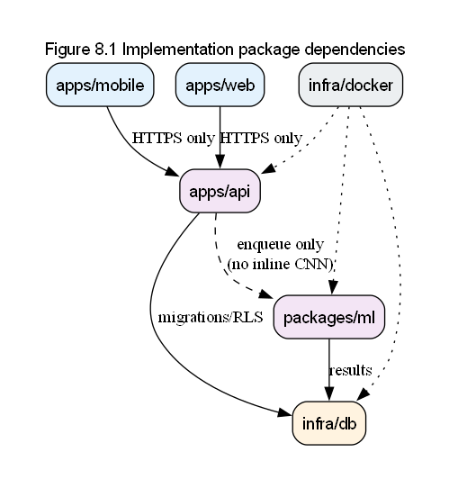

*Figure 8.1. Allowed package dependencies. Clients depend on the API contract. API depends on DB, Redis, and R2 adapters. Worker depends on Redis, DB, R2, and classifier code. The LLM adapter is reachable only from the API voice-draft path.*

## 8.2 Dependency rules

1. Clients call only the FastAPI HTTPS API (plus Supabase Auth and device OS services). They never open PostgreSQL or Redis.
2. The API never imports or invokes the CNN inline. It publishes jobs only.
3. `packages/ml` may write scan results and alerts but must not expose HTTP.
4. `VoiceSaleParser` cannot call persistence services. Draft responses are ephemeral API responses.
5. Only `SalesService` in `apps/api` deducts `quantity_remaining`.
6. Redis keys are namespaced `tenant:{tenant_id}:...`.
7. Migrations that add tenant-scoped tables include RLS in the same change.

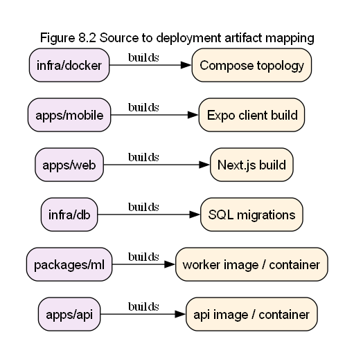

*Figure 8.2. Source trees map to container images, mobile binaries, web bundles, and applied migrations.*

## 8.3 Build and CI expectations

GitHub Actions runs lint and tests per area before merge. Docker Compose builds API (and later worker) images from the monorepo. Mobile and web use their own package managers under `apps/mobile` and `apps/web`. Course demos may run the full Compose target with stub ML before FL-2TC weights are available.

# 9. Data View

This view defines the logical data model, tenant isolation, and sale invariants. Physical indexes and migration filenames evolve in `infra/db/migrations/`; the rules here are stable for V1.

## 9.1 Entity-relationship model

Core entities: `tenants`, `users`, `products`, `batches`, `scans`, `alerts`, `device_tokens`, `sales`, `sale_items`.

| Entity | Primary key | Notable attributes | Cardinality notes |
|---|---|---|---|
| `tenants` | `id` uuid | name, timestamps | Root |
| `users` | `id` uuid | `tenant_id`, role, auth subject | N users per tenant |
| `products` | `id` uuid | `tenant_id`, name, `shelf_life_days`, `low_stock_threshold` | N products per tenant |
| `batches` | `id` uuid | `tenant_id`, `product_id`, intake dates, quantities | N batches per product |
| `scans` | `id` uuid | `tenant_id`, `image_path`, status, classification fields, optional `batch_id` | N scans per tenant |
| `alerts` | `id` uuid | `tenant_id`, type, severity, optional product/batch | N alerts per tenant |
| `device_tokens` | `id` uuid | `tenant_id`, user/device token fields | N tokens per tenant |
| `sales` | `id` uuid | `tenant_id`, `source`, `idempotency_key`, `created_at` | N sales per tenant |
| `sale_items` | `id` uuid | `tenant_id`, `sale_id`, `product_id`, `batch_id`, `quantity_sold` | N items per sale |

Every business table above includes `tenant_id` and an RLS policy in the same migration that creates the table (DR-001 through DR-012). Cross-tenant foreign keys are rejected by RLS and by application checks that resolve related rows under the same `app.tenant_id`.

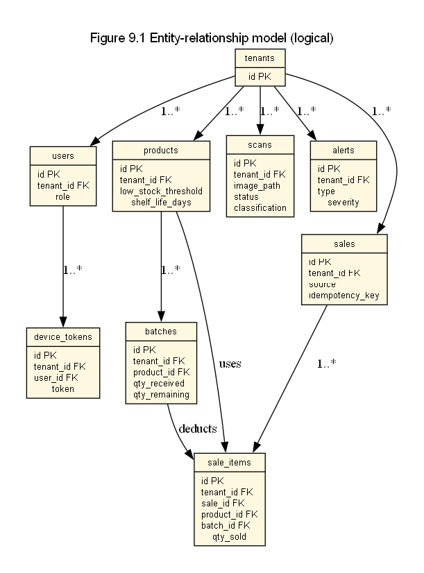

*Figure 9.1. Logical ER model for FreshLens V1, including sales, sale_items, and device_tokens.*

## 9.2 RLS and request context

On each authenticated API request (and on worker DB sessions that act for a tenant), the session executes `SET app.tenant_id = '<uuid from JWT>'` before business SQL. Policies follow:

```sql
USING (tenant_id = current_setting('app.tenant_id')::uuid)
```

Application `WHERE tenant_id = ...` filters are defense in depth only.

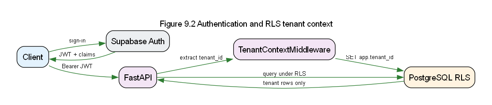

*Figure 9.2. JWT validation sets tenant context; PostgreSQL RLS restricts rows for the rest of the transaction.*

## 9.3 Sale and stock invariants

1. `sales.idempotency_key` is unique per tenant so retries cannot create a second deduction.
2. Each `sale_items` row references a product and a vendor-selected batch in the same tenant.
3. Before deduction, the sales transaction locks the selected batch rows and checks `quantity_remaining >= quantity_sold`.
4. Deduction updates `quantity_remaining` without allowing negative values.
5. Low-stock evaluation uses committed post-sale quantities.
6. Voice drafts are not tables of record; raw audio and transcripts are not retained by default.

## 9.4 Scan image storage

`scans.image_path` points at an object in Cloudflare R2. Binary image bytes are not stored in PostgreSQL. Classification fields remain null until the worker completes.

## 9.5 Traceability

| Rule | Requirement IDs |
|---|---|
| tenant_id + RLS same migration | DR-001, DR-002, DR-003 |
| sales / sale_items | DR-010, DR-011, FR-S-014 |
| device_tokens tenant scope | DR-012, FR-S-013 |
| non-negative batches / idempotent sales | NFR-R-005 |
| no default transcript retention | NFR-SEC-007 |

# 10. Size and Performance

This section ties SRS size and performance targets to architectural mechanisms.

## 10.1 Image size and scan acceptance

| Requirement | Mechanism |
|---|---|
| Image upload limit about 5 MB | API validates content length and rejects oversized bodies before enqueue |
| Scan acceptance within about 2 seconds after upload receipt | Handler stores image, inserts pending row, enqueues job, returns HTTP 202; no CNN in-process |
| At least 5 concurrent scan acceptances | Stateless API workers behind Compose/Uvicorn; Redis absorbs burst; DB inserts are short transactions |

Inference latency is intentionally excluded from the acceptance budget. Queue depth and model cost make classification time variable; clients poll or receive push when status becomes terminal.

## 10.2 Storage growth

Rough growth for scan images:

`stored_bytes ~= scans_per_day * average_image_bytes * retention_days`

PostgreSQL grows with scan metadata, alerts, sales, and batches, which are small relative to R2 image objects. Object lifecycle policies can shorten R2 retention without changing the relational model.

## 10.3 Sale latency

| Path | Budget characteristic |
|---|---|
| Manual / confirmed `POST /api/v1/sales` | Dominated by DB row locks, validation, and commit; no LLM call |
| `POST /api/v1/sales/voice-draft` | Dominated by external LLM latency; must not hold batch locks |
| Multi-item confirmed sale | One transaction locks all selected batches; V1 keeps item count bounded by what a vendor confirms in one submission |

Separating draft latency from deduction latency keeps inventory locks short and avoids holding stock locks while waiting on a model provider.

## 10.4 Throughput notes

Celery concurrency is scaled by worker replicas and broker capacity, not by lengthening the API request. Tenant-namespaced keys avoid accidental cross-tenant cache collisions but do not replace RLS.

# 11. Quality

For each quality attribute class in the SRS, this section names the architectural mechanism that carries it.

## 11.1 Reliability

| Requirement theme | Mechanism |
|---|---|
| Scan acceptance despite slow ML | HTTP 202 + Celery; failed jobs mark scan `failed` without blocking the API process |
| Sale atomicity and idempotency (NFR-R-005) | Single DB transaction; unique tenant idempotency key; batch row locks; reject oversell |
| Push flakiness | Persist alerts first; push is best-effort wake-up |

## 11.2 Security

| Requirement theme | Mechanism |
|---|---|
| Authenticated API access | Supabase JWT validation on protected routes |
| Tenant isolation (NFR-SEC-003) | `app.tenant_id` + Postgres RLS on every business table |
| No tenant id from body | Middleware reads claims only |
| Redis key safety (NFR-SEC-006) | `tenant:{tenant_id}:...` namespaces |
| LLM cannot mutate inventory (NFR-SEC-007) | Voice-draft endpoint is read-only toward stock; no DB credentials for the model |

## 11.3 Privacy

Voice flows send transcript text to the parser and discard raw audio and transcripts by default. Sale records store confirmed product, batch, and quantity only. Scan images live in R2 under tenant-scoped paths and are not required for sale deduction.

## 11.4 Maintainability and portability

Layered packages and OpenAPI keep client and server contracts explicit. Stub versus FL-2TC share `FreshnessClassifier`, so mid-evaluation demos can swap implementations without rewriting routers. Compose packages API, worker, Redis, and Postgres for local portability. Provider-neutral LLM adapter limits lock-in to one interface.

## 11.5 Extensibility

V2 features such as multi-item detection or learned rot dates can extend the worker and schema without changing the 202 scan acceptance pattern or the shared sales service rule. A second queue system is deliberately disallowed to avoid split operational semantics.

## 11.6 Usability

| Requirement theme | Mechanism |
|---|---|
| Explicit sale confirmation (NFR-U-009) | Manual form and voice draft review both require confirm before `POST /api/v1/sales` |
| Microphone / STT problems | Fallback to manual Record Sale (FR-V-011) |
| Async scan feedback | Pending and processing states in UI; push on completion |

## 11.7 Shared business logic

Stock deduction, low-stock evaluation inputs, and RLS context are centralized so mid-evaluation UI and final voice UI cannot diverge on inventory rules. That shared path is the quality backbone for FR-S-014 through FR-S-016.

# 12. References

1. FreshLens Project Proposal, CS3203 Group 21, PID 5, July 2026.
2. FreshLens Feasibility Study Report, CS3203 Group 21, July 2026.
3. FreshLens System Requirements Specification, `docs/srs/FreshLens-SRS.md`.
4. FreshLens API V1 OpenAPI contract, `docs/api/v1/openapi.yaml`.
5. CS3203 lecture materials on software architecture and the 4+1 view model (course PDF "lec 4 - design").
6. P. Kruchten, "The 4+1 View Model of Architecture," IEEE Software, vol. 12, no. 6, pp. 42-50, 1995.
7. FastAPI documentation, https://fastapi.tiangolo.com/
8. PostgreSQL Row Security Policies, https://www.postgresql.org/docs/current/ddl-rowsecurity.html
9. Supabase Auth documentation, https://supabase.com/docs/guides/auth
10. Celery documentation, https://docs.celeryq.dev/
11. Redis documentation, https://redis.io/docs/
12. Cloudflare R2 documentation, https://developers.cloudflare.com/r2/
13. Expo documentation, https://docs.expo.dev/
14. Next.js documentation, https://nextjs.org/docs
15. diagrams.net (Draw.io) online visual editor, https://app.diagrams.net/
16. FreshLens GitHub issues #6, #19, #45 through #55, and sales issues #80 through #84.

## Diagram assets

Architecture figures in this SAD were authored in the diagrams.net (Draw.io) online visual editor and exported as PNG files under `docs/design/diagrams/`. The master document `docs/design/FreshLens-SAD.md` concatenates sections `01` through `12` in order.
